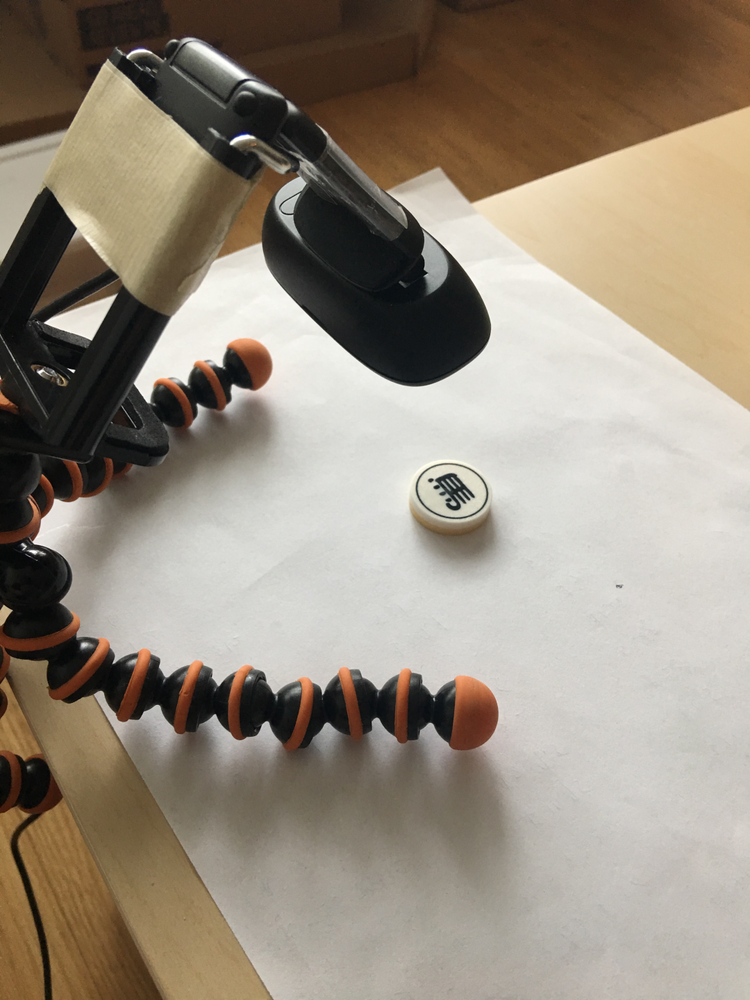
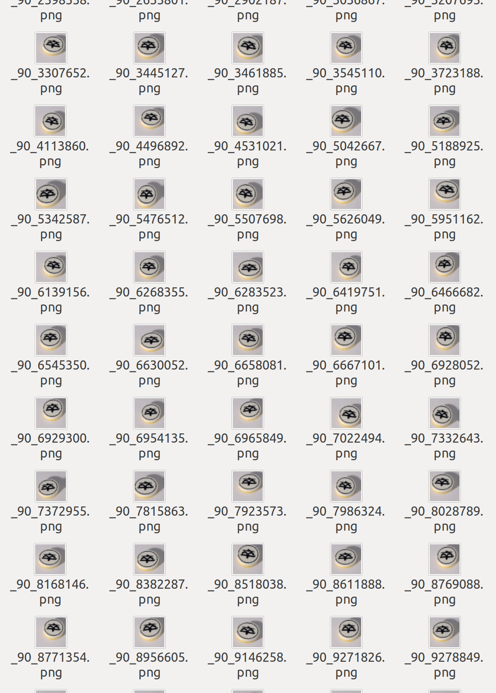
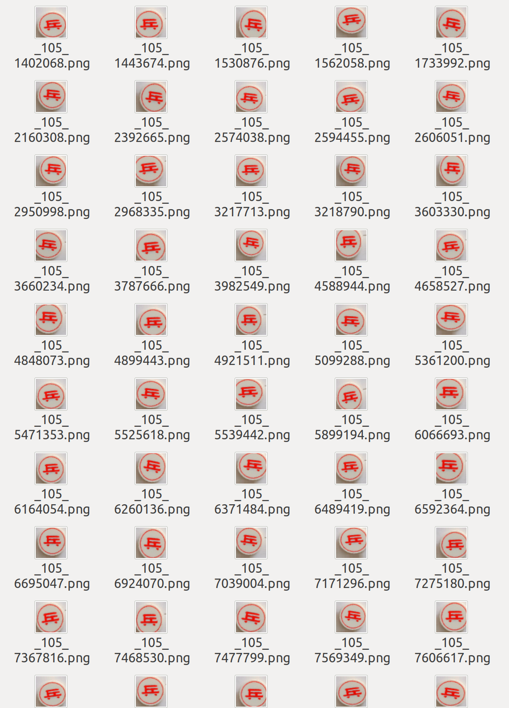

# Chinese Chess Piece Recognition
> EECS349 Machine Learning at Northwestern University (lectured by Doug Downey)

#### Evan Chien [chihchien2018@u.northwestern.edu](chihchien2018@u.northwestern.edu) | Midoding Dai [m.dai@u.northwestern.edu](m.dai@u.northwestern.edu)

---
## Goal

The goal of our project is to classify Chinese Chess pieces. Given an image of a chess piece (traditional chinese character on top of it), we hope our classifier recognizes the color and the types of chess pieces at a strong confidence level. **To summarize, inputs are camera frames of a certain Chinese Chess piece, outputs are the color and the type of the according piece type.**

This is an vital part of robot playing Chinese Chess, which is our ultimate goal. To reach our ultimate goal, we also need do some real-time (or in video stream) classification of Chinese Chess pieces, which we will have experiments and according videos in the following pages.

## Model Selection

As we all know, to solve a image classification problem, CNN is definitely the best choice among ML/DL architectures. We tested several CNN structures, mostly focused on a toy CNN model we built by ourselves and a fine-tuned VGG16 CNN model. **We implemented these models using Keras (with TensoeFlow as backend)**. For the toy CNN model, it contains 3 CONV layers of 32, 32 and 64 feature maps; for the fine-tuned VGG16 CNN model, keep all original bottom CONV and Pooling layers' weights to extract most informative features, and train top FC layers on our own dataset to get a customized top layer classifier.

## Key Results
We tested those models on a later generated test datase. The toy CNN model has reached a 95% test accuracy, while the fine-tuned VGG16 CNN model reached an accuracy of 92%, which is pretty nice result. Suprisingly, our shallow layer toy CNN model performed better than fine-tuned VGG16 CNN model. As with a higher accuracy, we will use our toy CNN model to do further analysis including learning curve and confusion matrix. We also tested model performance under a real-time camera setting, results can be found in the following pages.

## Dataset
The Chinese chess has black and red chess pieces holding by two players. Each one has 7 different kind of chess.Thus, there are 14 classes in out dataset.

The data classes in order are:

####

The dataset we use is manually taken by digital camera as in below.
####

We took 18 pictures of each chess type as the source of out training and validation data. And, with the help of  `ImageDataGenerator` in `Keras`, we were able to generate a dataset of 14,000 pictures (1000 per class) for training and 2,800 pictures (200 per class) for validation. The augmentation includes rotation, shearing, shift and zoom. You can find the augmented training/verification dataset in the data folder. Below are the snap shots of the augmented images, where you can get some intuitive ideas about what does augmented data look like and whether they make sense. They looks like real images taken from different camera settings, which make full sense and hopefully will serve as real images to train our CNN model.

    

As for testing, we decited to capture the frames from camera live feed for prediction.
## Implementations
Dependencies: Python3, Numpy, Keras, Scikit-learn, OpenCV, PIL, TensorFlow
For details, please refer to the comments in each file.

* [dataAugment.py](./code/dataAugment.py): It is a help function which can automatically generate an augmented dataset with specific requirements, organize all data in the way compatible with other scripts. It can be used to generate augmented dataset, and for further analysis about influential factors of dataset.
* [toy_cnn_mini.py](./code/toy_cnn_mini.py): The training function. It reads in images with pre-defined size (default:56). After 10 epochs, 400 steps per epoch training, a `.h5` file with model parameters is created and ready for prediction.
* [evaluate_model_spec.py](./code/evaluate_model_spec.py): The performance evaluation function. It reads in a batch of test images, converts them to the pre-defined size and output the confusion matrix and the classification report of the model.
* [rt_test.py](./code/rt_test.py): This is the real time test function that we use for testing.
* [vgg16_cnn_bottleneck.py](./code/vgg16_cnn_bottleneck.py): This is the function we use to tune the bottleneck feature.

##  Test result
The model used in the test below is `toy_cnn_mini_model_30_1800_5epo_0.97.h5`. Below are two video clips with different lighting conditions. Please note that the implementation of this function is without localization and thus we create a ROI in the center for prediction and we have to place the chess pieces near the center point.

As you can see in the links below, despite we have strong confidence in training/validation, our classifier still has some problem with class `b_ma`, `b_xiang` and `'b_pao`. These are the ones in black with lower precision. Surprisingly, the classifier does better with red chess pieces than with black ones.

[Video 1 with light condition 1](https://youtu.be/2Fv16iSG5F4)

[Video 2 with light condition 2](https://youtu.be/BOO4li_PxPQ)

## Analysis
### Learning rate
Learning rate is an important question as if we have the idea of how fast our classifier converges to its target accuracy. It also gives us the idea of how good our classifier is to the task.

Here, we tried to cut in from a different angle. That is, how much the number of our data affects the learning rate. We generated different numbers (range from 100 to 20000) of pictures out from different number of `ORIGINAL` pictures (10, 20, 30 per class) with ImageDataGenerator.

First, we evaluate when the accuracy hits 50%.
* 10 pics/class
    * Hits 50% with 2000 pictures in total

* 20 pics/class
    * Hits 50% with 1000 pictures in total

* 30 pics/class
    * Hits 50% with 1000 pictures in total

  

Now, let's evaluate when they reach 90%.
* 10 pics/class
    * Hit 90% with 5000 pictures in total

* 20 pics/class
    * Hits 90% with 5000 pictures in total

* 30 pics/class
    * Hits 90% with 5000 pictures in total

And, last, the learning curve of training/validation versus original sample counts. In fact, as you can see in the graphs, most of the time the differences between curves is not huge. we feel if we have larger number gap we would see the gap more easily.

### Confusion matrix
Another important thing we need to think of is which classes in the dataset our classifier has strong confidence and which doesn't.

Below is the confusion matrix and the classification report of our fine-tuned model. The test dataset is also generated by image augmentation and has 200 samples per class.

From left to right and from top to down are in the order of this list:
`['b_jiang','b_ju', 'b_ma', 'b_pao', 'b_shi', 'b_xiang', 'b_zu', 'r_bing', 'r_ju', 'r_ma', 'r_pao', 'r_shi', 'r_shuai', 'r_xiang']`

We can see that `r_ju` and `r_xiang` are with lower precision and the red ones (classes starting with r_) have lower precision comparing with the black.

## Future Works

### Influential factors
In our real time setting tests (using webcam to classify chinese chess pieces, see this photo for example), we see more frequent mis-classifications on some of the black chess (mostly with complicated Chinese characters) pieces, while predictions of the red ones perform much better. This contridicts the classification report we generated and we need do more exploration and experiments to find out whether it is the camera or other factors affecting the accuracy.

### Optimization
As mentioned in the status update, we are still working on fine-tuning the pretrained weights of VGG16 CNN model (not only top FC layers we discussed above, but also several top CONV layers). For now, it works but it is not good as the two we discussed. We will keep on playing with it and see if we can get it better.

### Comparing BoW
Visual BoW is a way to represent images. Based on that, we can train classifiers (multi-layer perceptron, SVM, etc) on those vector-presented images. This is a super powerful way to build image classifier without using CNN. Choosing the right representation model and good classifier is just another big task, so I leave it for now and will finish that in the near future.
