# Chinese Chess Piece Recognition - EECS 349 Machine Learning Final Project

## Evan Chien / Miaoding Dai
---
## Goal

The goal of our project is to classify Chinese Chess pieces. Given an image of a chess piece (traditional chinese character on top of it), we hope our classifier recognizes the color and the types of chess pieces at a strong confidence level.

## Our model
We chose Keras + TensoeFlow to build up our CNN model. The moddel has 3 layers of 32, 32, 64 feature maps, the input is color image with 56*56 size and the output is the class of the chess in the picture for sure.

## Dataset

The Chinese chess has black and red chess pieces holding by two players. Each one has 7 different kind of chess.Thus, there are 14 classes in out dataset.  

The data classes in order are: 
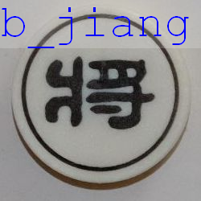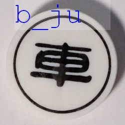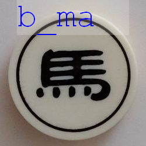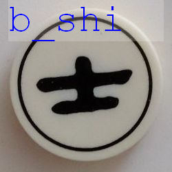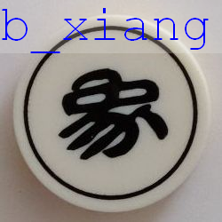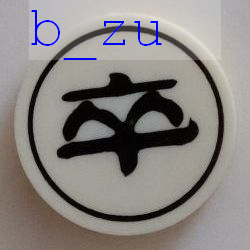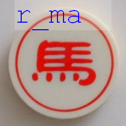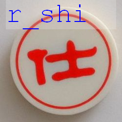

The dataset we use is manually taken by digital camera as in below.  
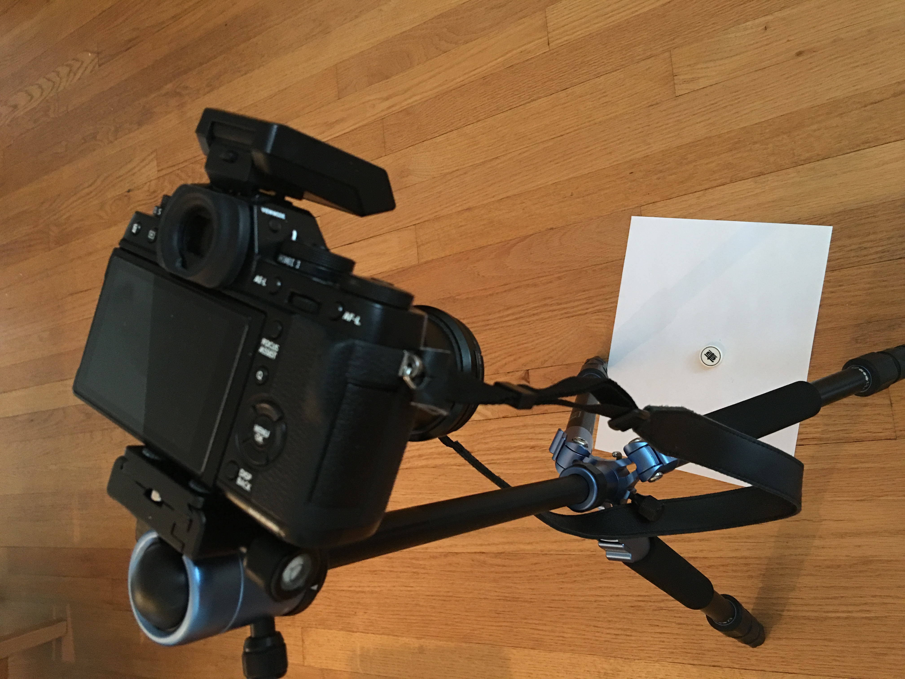  

We took 18 pictures of each chess type as the source of out training and validation data. And, with the help of  `ImageDataGenerator` in `Keras`, we were able to generate a dataset of 14,000 pictures (1000 per class) for training and 2,800 pictures (200 per class) for validation. You can find the training/verification dataset in the data folder.

As for testing, we created another dataset that was never be in part of the training/verification process. And, the test data is taken by a different camera.
## Functions
Dependencies: Keras, Numpy, Python 3, OpenCV, PIL, TensorFlow
For details, please refer to the comments in each file.

* toy_cnn_mini.py: The training function. It reads in images with pre-defined size (default:56). After 10 epochs, 400 steps per epoch training, a `.h5` file with model parameters is created and ready for prediction.
* predict.py: The batch predict function. It reads in a batch of test images, converts them to the pre-defined size and output the confusion matrix and the classification report.
* toy_cnn_mini_test.py: This file reads in a single file for fast classification. 

##  Test result
The model used in the test below is `toy_cnn_mini_model_baseline.h5`. Below are two video clips with different lighting conditions. Please note that the implementation of this function is without localization and thus we create a ROI in the center for prediction.  

As you can see in the links below, despite we have strong confidence in training/validation, our classifier still has some problem with class `b_ma`, `b_xiang`, `'b_pao` and `b_shi`.

  



## Analysis  
### Learning rate
Learning rate is an important question as if we have the idea of how fast our classifier converges to its target accuracy. It also gives us the idea of how good our classifier is to the task.

Here, we tried to cut in from a different angle. That is, how much the number of our data affects the learning rate. We generated different numbers (range from 100 to 20000) of pictures out from different number of `ORIGINAL` pictures (10, 20, 30 per class) with ImageDataGenerator.

First, we evaluate when the accuracy hits 50%.
* 10 pics/class
    * Hits 50% with 2000 pictures in total
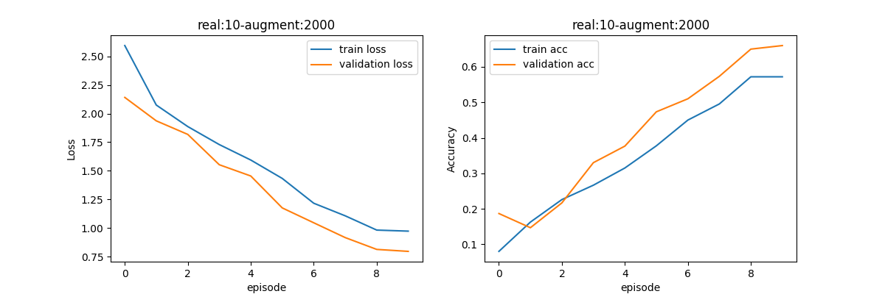
* 20 pics/class
    * Hits 50% with 1000 pictures in total
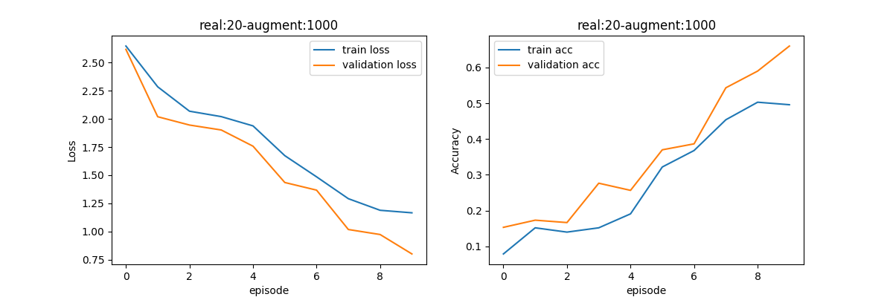
* 30 pics/class
    * Hits 50% with 1000 pictures in total
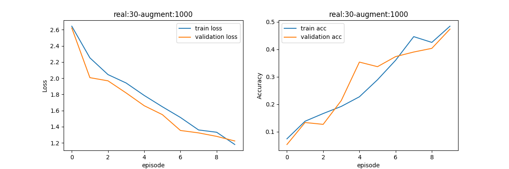
    

Now, let's evaluate when they reach 90%.
* 10 pics/class
    * Hit 90% with 5000 pictures in total
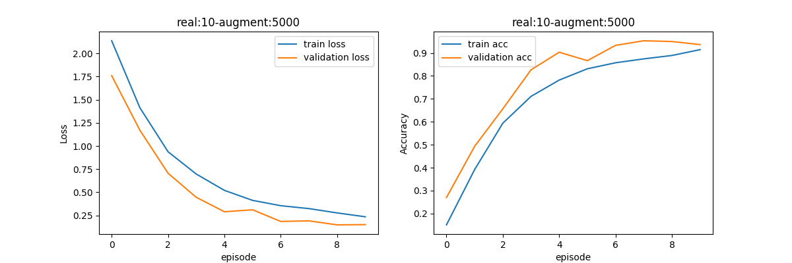
* 20 pics/class
    * Hits 90% with 5000 pictures in total
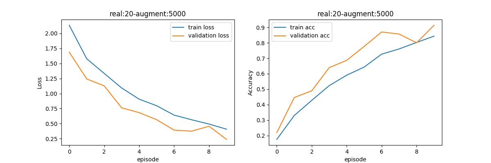
* 30 pics/class
    * Hits 90% with 5000 pictures in total
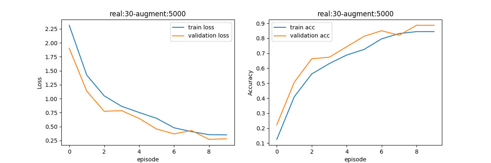

And, last, the learning curve of training/validation versus original sample counts. In fact, as you can see in the graphs, most of the time the differences between curves is not huge.
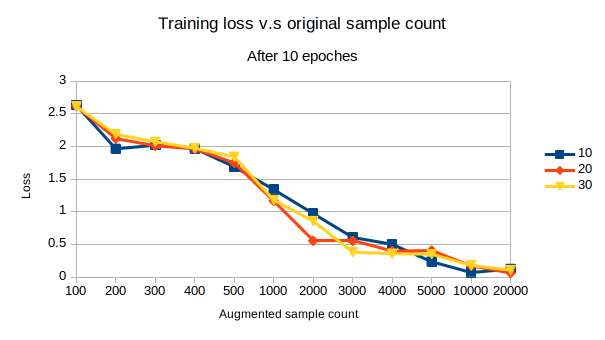
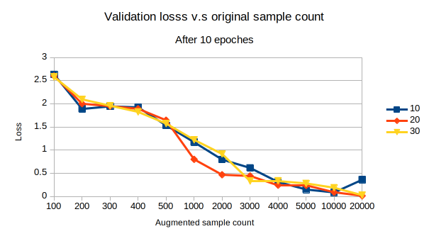

### Confusion matrix
Another important thing we need to think of is which classes in the dataset our classifier has strong confidence and which doesn't.

Below is the confusion matrix and the classification report of our fine-tuned model. The test dataset is also generated by image augmentation and has 200 samples per class. 

From left to right and from top to down are in the order of this list:   
`['b_jiang','b_ju', 'b_ma', 'b_pao', 'b_shi', 'b_xiang', 'b_zu', 'r_bing', 'r_ju', 'r_ma', 'r_pao', 'r_shi', 'r_shuai', 'r_xiang']`
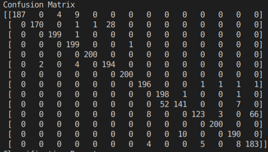
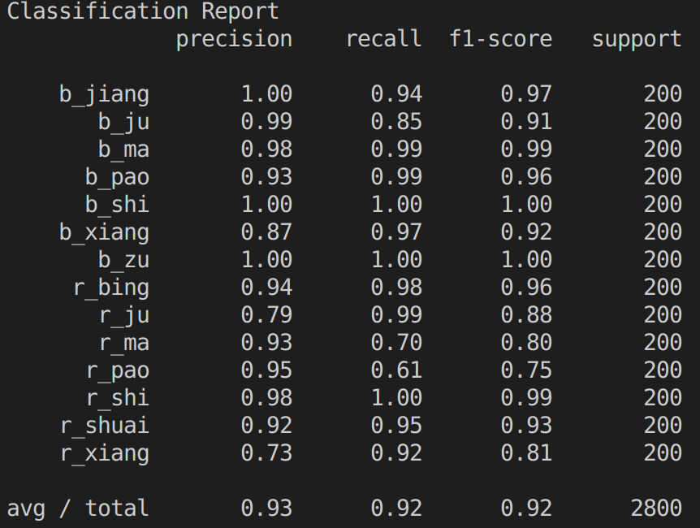

We can see that `r_ju` and `r_xiang` are with lower precision and the red ones (classes starting with r_) have lower precision comparing with the black.

## Future Works 
### Optimization
We understand that our model is not stable enough and there are still some mis-judgments found during live test. We are working on tuning with some layer freezed.

### Comparing BoW
Visual BoW is a technique people usually use to solve tasks like this. A study and a comparison between CNN and BoW on smaller sample is what we will work on in the near future.